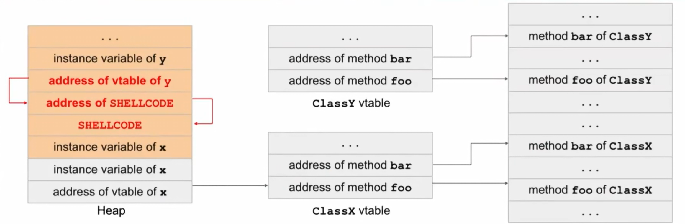

# <center> Memory Safety Vulnerabilities

---

## Buffer Overflow 
Buffer overflow vulnerabilities are a particular risk in C

Absence of automatic bounds-checking for array or pointer accesses:
if the programmer declares an array char `buffer[4]`, C will not automatically throw an error if the programmer tries to access `buffer[5]`

```c
char buf[8];
int authenticated = 0;
void vulnerable() {
    gets(buf);
}
```

- Defined outside of the function, `char buf[8]` and `authenticated` are both located in the static part of memory.

- In C, static memory is filled in the order that variables are defined, so `authenticated` is at a higher address in memory than `buf`

static:
|   |
|---|
|authenticated|
|buf|
|buf|
|| 

If the attacker can write 9 bytes of data to buf (with the 9th byte set to a non-zero value), then this will set the authenticated flag to true, and the attacker will be able to gain access.

```c
char buf[8];
int (*fnptr)();
void vulnerable() {
    gets(buf);
}
```
|   |
|---|
| fnptr  |
|buf|
|buf|
|| 


the attacker can overwrite fnptr with any address of their choosing, redirecting program execution to some other memory location

---

## Stack Smashing
One powerful method for exploiting buffer overrun vulnerabilities takes advantage of the way local variables are laid out on the stack.
### Stack Memory Layout
```c
void vulnerable() {
    char buf[8];
    gets(buf);
}
```
stack:
||
|---|
|rip of vulnerable|
|fsp of vulnerable|
|buf|
|buf|
||

Data storage order:
- The stack only grows down when we call a new function and need to allocate additional memory. When we call `gets`, user input is still written from lower addresses to higher addresses.
- x86 is **little-endian**
### Attack
- shellcode at a known address
input: AAAAAAAAAAAA\xef\xbe\xad\xde

    ||
    |---|
    |0xDEADBEEF|
    |AAAA|
    |AAAA|
    |AAAA|
    ||

- shellcode injection
  - short:
    ||
    |---|
    |&buf|
    |AAAA|
    |shellcode|
    |shellcode|
    ||
    
  - long:
    ||
    |---|
    |shellcode|
    |&rip + 4|
    |AAAA|
    |AAAA|
    |AAAA|
    ||

### Vulnerable C Library Functions
- gets -> fgets
  ```c
  char name[20];
  fgets(name, sizeof(name), stdin);
  ```
- strcpy -> strncpy / strlcpy
- strlen -> strnlen
- sprintf -> snprintf


## Integer Overflow

C compiler won’t warn about the type mismatch between signed `int` and `unsigned int`; it silently inserts an implicit cast. 
```c
void *memcpy(void *dest, const void *src, size_t n);
```
```c
typedef unsigned int size_t;
```

```c
char buf[8];
void vulnerable() {
    int len = read_int_from_network();
    char *p = read_string_from_network();
    if (len > 8) {
        error("length too large: bad dog, no cookie for you!");
        return;
    }
    memcpy(buf, p, len);
}
```
paylaod: a negative `len`

```c
void vulnerable() {
    size_t len;
    char *buf;

    len = read_int_from_network();
    buf = malloc(len+5);
    read(fd, buf, len);
    ...
}
```
payload: a large `len` e.g. 0xFFFFFFFF

check bounds whenever add to integers
```c
void safe(size_t len, char *data){
    if (len > MAX_SIZE - 2) {
        return;
    }
    char *buf = malloc(len + 2);
    if (!buf) {
        return;
    }
    memcpy(buf, data, len);
    buf[len] = '\n';
    buf[len + 1] '\0';
}
```

## Format string vulnerabilities

```c
printf("x has the value %d, y has the value %d, z has the value %d \n", x, y, z);
```
arguments to a function are pushed onto the stack in reverse order
||
|---|
|z|
|y|
|x|
|&"x has the value %d, y has the value %d, z has the value %d \n"|
|rip of printf|
|sfp of printf|

In cases of a mismatch, it will fetch some data from the stack that does not belong to the function call.
```c
printf("x has the value %d, y has the value %d, z has the value %d \n", x, y);
```


%n → Treat the argument as an address and write the number of characters that have been printed so far to that address
```c
printf("item %d:%n", 3, &val);   // store 7 in val
```
mismatch:
```c
printf("000%n");    // write 3 to the integer pointed to by address located 8 bytes above the RIP of printf
```
||
|---|
|???    // fetch this as the second argument, treat it as a pointer|  
|&"000%n"   // the first argument|  
|rip of printf|
|fsp of printf|

```c
char buf[64]

void vulnerable(void) {
    char *secret_string = "pancake";
    int secret_number = 42;
    if (fgets(buf, 64, stdin) == NULL) {
        return;
    } 
    printf(buf);
}
```
||
|---|
|&secret_string|
|secret_number|
|&buf -> "%d%n"|
|rip of printf|
||


- input: %d%n
- output: 42 
write 2 to the secret_string

never use untrusted input in the first argument of printf
```c
printf("%s", buf);
```

## Heap Vulnerability
Objects are allocated in the heap (using `malloc` in C and `new` in C++...)

### Heap Overflow
**C++ vtable**
Each class has a virtual table (table of function pointers), and each object points to its class's vtable

Suppose an instance variable of x is a buffer that we can overflow:

when y calls its method, the shellcode will be executed

### Use-after-free
```c

void test_uaf() {
    int *arr1 = malloc(10 * sizeof(int));
    free(arr1); // the memory is freed, but arr1 still points to it

    int *arr2 = malloc(10 * sizeof(int));  
    for (int i = 0; i < 10; i++) {
        arr2[i] = i + 100;  
    }

    printf("UAF: %d\n", arr1[0]); // might print 100
}
```

 