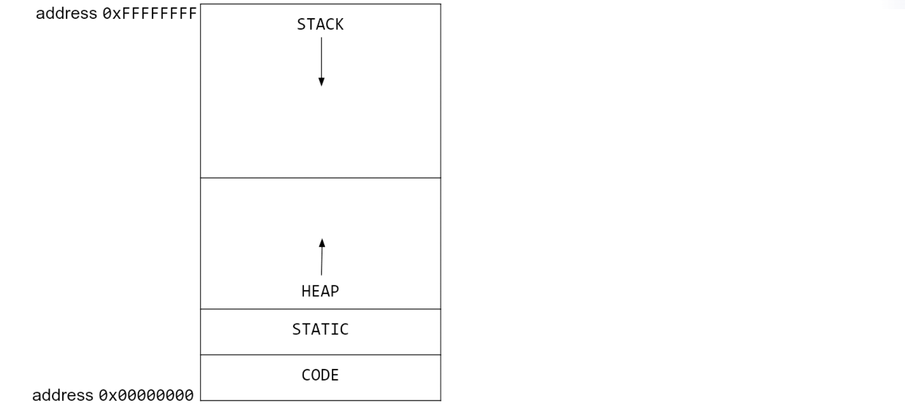
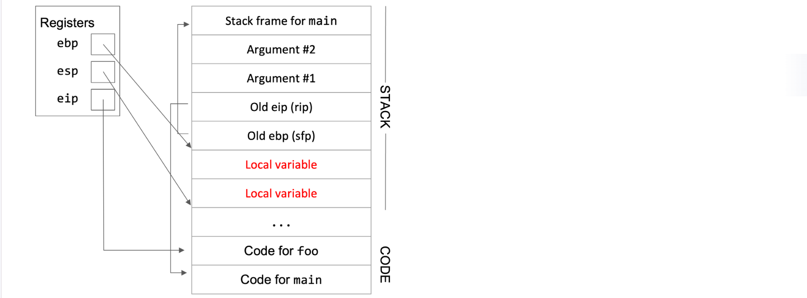

## Memory Layout 

## Little Endian
x86 is a **little-endian** system. This means that when storing a word in memory, the least significant byte is stored at the lowest address, and the most significant byte is stored at the highest address.
## Registers
The e in the register abbreviations stands for “extended” and indicates that we are using a 32-bit system (extended from the original 16-bit systems).

- `eip` is the instruction pointer, and it stores the address of the machine instruction currently being executed. 
- `ebp` is the base pointer, and it stores the address of the **top** of the current stack frame. 
- `esp` is the stack pointer, and it stores the address of the **bottom** of the current stack frame. 
  
The top of the current stack frame is the highest address associated with the current stack frame, and the bottom of the stack frame is the lowest address associated with the current stack frame.

## Pushing and Popping
push:
- First, we have to allocate additional space on the stack by decrementing `esp`. 
- Then, we store the value in the newly allocated space. 

pop:
- The x86 pop instruction increments `esp` to remove the next value on the stack. 
- It also takes the value that was just popped and copies the value into a register.

## Function Calls
In this example, main is the caller function and foo is the callee function. 

1. Push arguments onto the stack.
2. Push the old eip / **rip** (return instruction pointer) on the stack.
3. Update eip.
4. Push the old ebp / **sfp** (saved frame pointer) on the stack. 
5. Move ebp down.
6. Move esp down.
   Allocate new space for the new stack frame
7. Execute the function.
   
   Local variables and any other necessary data can now be saved in the new stack frame. 
   Additionally, since `ebp` is always pointing at the top of the stack frame, we can use it as a point of reference to find other variables on the stack. 
8. Move esp up.
   Once the function is ready to return, we increment esp to point to the top of the stack frame (ebp). 
   (Anything on the stack below esp is undefined.)
9.  Restore the old ebp (sfp). 
10. Restore the old eip (rip). 
11. Remove arguments from the stack.
    We remove them by incrementing esp.