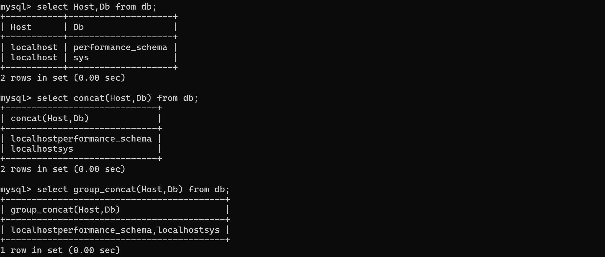

# <center> MySQL 基本命令
---
>- Note that all text commands must be first on line and end with ';'
>- 大小写都可以
---


## 数据库操作
**查看数据库**
```sql
SHOW DATABASES;
```

 **创建数据库**
 ```sql
 CREATE DATABASE my_database;
 ```

**使用数据库**
```sql
USE my_databases;
```

**导入和导出数据库**
- **导入**
```sql
mysql -u root -p my_database < /path/to/file.sql
```
- **导出**
```sql
mysqldump -u root -p my_database > /path/to/file.sql
```

**删除数据库**
```sql
DROP DATABASE my_database;
```
---

## 数据表操作
**查看表**
```sql
SHOW TABLES;
```

**创建表**
```sql
CREATE TABLE users (
    id INT AUTO_INCREMENT PRIMARY KEY,
    name VARCHAR(100),
    email VARCHAR(100)
);
```

**查看表结构**
```sql
DESCRIBE users;
DESC users;  -- 简写
SHOW COLUMNS FROM users;
```

**修改表结构**
```sql
ALTER TABLE table_name ADD column_name datatype;  -- 添加列
ALTER TABLE table_name DROP COLUMN column_name;  -- 删除列
ALTER TABLE table_name MODIFY COLUMN column_name new_datatype;  -- 修改列类型
ALTER TABLE table_name RENAME TO new_table_name;  -- 重命名表
```

**删除数据表**
```sql
DROP TABLE users;
```
---

## 数据操作 (DML)

**插入数据**
```sql
INSERT INTO users (name, email) VALUES ('John Doe', 'john@example.com');
-- 插入多行
INSERT INTO table_name (column1, column2, ...) 
VALUES 
    (value1, value2, ...),
    (value1, value2, ...),
    ...;
```

**查询数据（查表）**
```sql
SELECT 
    field1,field2, ...
FROM 
    table1,table2,...
[WHERE condition1 AND/OR condition2...]
[GROUP BY column_name]
[HAVING group_condition]
[ORDER BY column_name [ASC|DESC]]
[LIMIT [offset,] row_count];
```

- **基本查询**
```sql
SELECT * FROM table_name;  -- 查询所有列
SELECT column1, column2 FROM table_name;  -- 查询特定列
```
- **条件查询**
```sql
SELECT * FROM table_name WHERE column1 = value;
SELECT * FROM table_name WHERE column1 > value;
SELECT * FROM table_name WHERE NOT column1 = value;
SELECT * FROM table_name WHERE column1 BETWEEN value1 AND value2;
SELECT * FROM table_name WHERE column1 LIKE 'pattern%';
SELECT * FROM table_name WHERE column1 IN (value1, value2, ...);
```
- **排序**
```sql
SELECT * FROM table_name ORDER BY column1 DESC;  
-- ASC（默认）ascending/ DESC descending
SELECT * FROM table_name ORDER BY 1;  
-- 也可以用索引（从1开始）
```
- **限制**
```sql
SELECT * FROM table_name LIMIT 10;  -- 前10条
SELECT * FROM table_name LIMIT 5, 10;  -- 从第6条开始的10条
```

- **整合**
```sql
SELECT CONCAT(col_name1,col_name2...) FROM tabel_name//整合列数据
SELECT GROUP_CONCAT(col_name1,col_name2...) FROM tabel_name//整合行、列数据（先列再行）
```
效果


- **联合查询**
```sql
-- 合并两个查询结果
SELECT ...
UNION
SELECT ...
```
注意前后列数一致


- **聚合函数**
```sql
SELECT COUNT(*) FROM table_name;
SELECT SUM(column1) FROM table_name;
SELECT AVG(column1) FROM table_name;
SELECT MAX(column1) FROM table_name;
SELECT MIN(column1) FROM table_name;
```

- **分组查询**
```sql
SELECT column1, COUNT(*) 
FROM table_name 
GROUP BY column1
HAVING COUNT(*) > 5;
```

**更新数据**
```sql
UPDATE users 
SET email = 'john.doe@example.com' 
WHERE name = 'John Doe';
```

**删除数据**
```sql
DELETE FROM users WHERE name = 'John Doe';
```
---
**使用帮助**
```sql
HELP;
HELP SHOW;//查看特定命令的帮助
```