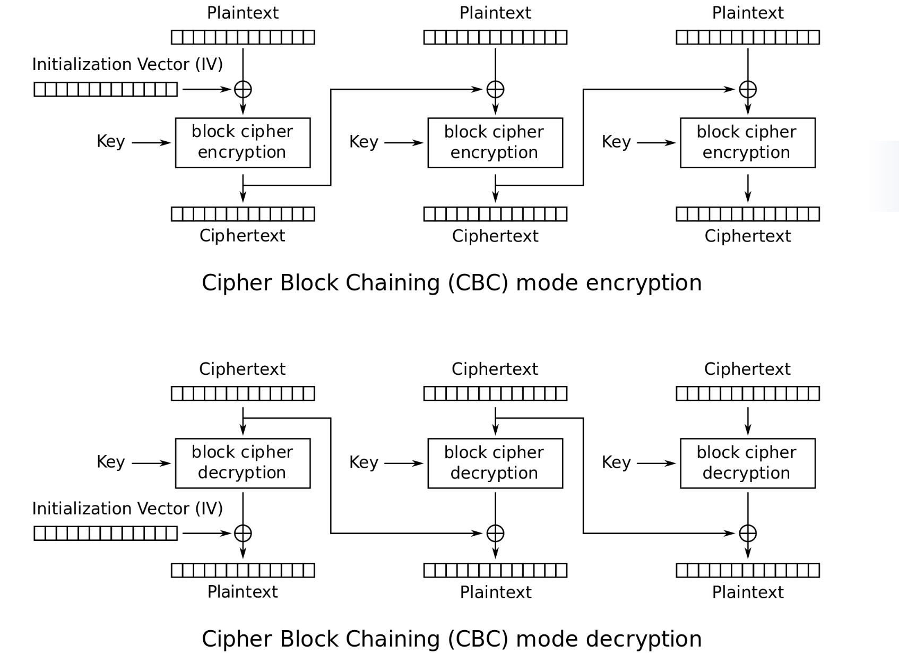
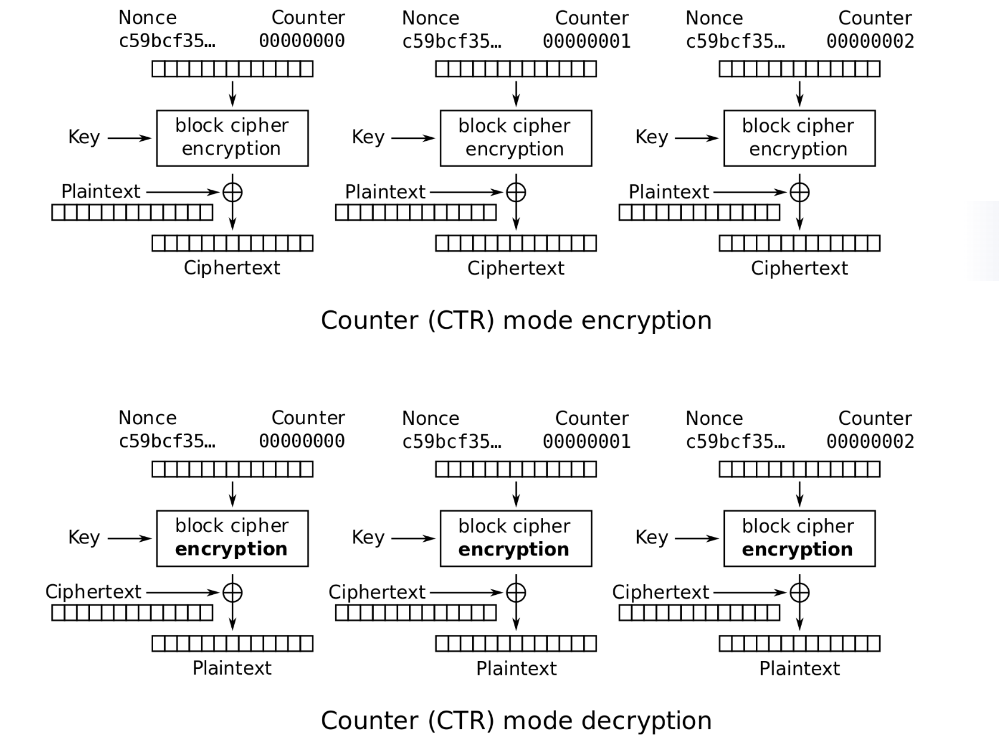

# 
 Symmetric-Key Encryption
---
>we are going to assume that all messages are bitstrings, which is a sequence of bits, 0 or 1
## Symmtric-Key Encrytion
Algorithm:
$$
\begin{aligned}
K = KeyGen() \\
C = Enc(M, K) \\
M = Dec(C, K)
\end{aligned}
$$
Correctness: 
$$
Dec(Enc(M), K) = K
$$

## One Time Pad (OTP)

Encryption: $C = M \oplus K$
Decryption: $M = C \oplus K$

Correctness: $(M \oplus K) \oplus K = M$

Drawback: The shared key cannot be reused to transmit another message

if a key is uesd twice:

$$
\begin{aligned}
C_1 = M_1 \oplus K \\
C_2 = M_2 \oplus K \\
=> C_1 \oplus C_2 = M_1 \oplus M_2
\end{aligned}
$$

## Block Ciphers

Encryption takes in an n-bit plaintext and a k-bit key as input and outputs an n-bit ciphertext. 
Decryption takes in an n-bit ciphertext and a k-bit key as input and outputs an n-bit plaintext.
$$
E:\{0,1\}^n \times \{0,1\}^k -> \{0, 1\}^n
$$
given K:
$$
E_k:\{0,1\}^n -> \{0, 1\}^n
$$

AES: k = 128, 192, 256

Correctness: $Ek(M)$ should be bijective 
Efficiency: XORs and bit-shifting (fast)
Security: 
- computationally indistinguishable from random permutation
- not IND-CPA secure since it's deterministic

###  Block Cipher Modes of Operation
Issues of block cipher:
- fixed-length message
- determinitic
  
To fix these problems, the encryption algorithm can either be randomized or stateful. 
The decryption algorithm, however, is neither randomized nor stateful.

**ECB Mode (Electronic Code Book)**
- break M into n-bit blocks 
- encode each block
- concatenate
  
encryption: $C_i = E_k(M_i)$

decryption: $M_i = D_k(C_i)$

**CBC Mode (Cipher Block Chaining)**

Probabilistic Encryption *if IV is random*

**CFB Mode (Ciphertext Feedback Mode)**

**OFB Mode (Output Feedback Mode)**

**Counter (CTR) Mode**

encryption: $C_i = E_k(IV||i) \oplus M_i$

decryption: $M_i = E_k(IV||i) \oplus C_i$

---

|  sequential | parallel  |
|---|---|
|   |   |

<https://textbook.cs161.org/crypto/symmetric.html#64-block-ciphers>

### Padding

**Padding** is the process of adding extra data to a message ​​before​​ encryption to ensure its length meets the specific requirements of the cryptographic algorithm.

One correct padding scheme is PKCS#7 padding. In this scheme, we pad the message by the number of padding bytes used.

### AES
AES encryption operates on a block of data through multiple **rounds** of processing. 
Each round applies a set of reversible transformations to a two-dimensional 4x4 array of bytes called the **​​State​​**.

The main steps for encrypting a single 128-bit block are:

Key Expansion
  The original cipher key is used to derive a set of round keys (a key schedule) using the Rijndael key schedule algorithm.

Initial Round:​
- ​​AddRoundKey
  Each byte of the state is combined with a round key using bitwise XOR.

Main Rounds (Repeated for 9, 11, or 13 rounds depending on key size):​
- SubBytes
  A non-linear substitution step where each byte is replaced with another byte according to a lookup table (S-box). 
  This provides confusion.
- ShiftRows
  A transposition step where each row of the state is shifted cyclically a certain number of steps. The first row is not shifted, the second is shifted by one, etc. 
  This provides diffusion.
- MixColumns
  A mixing operation which operates on the columns of the state, combining the four bytes in each column. 
  This also provides diffusion.
- AddRoundKey
  The round key is XOR'd with the state again.

Final Round (No MixColumns):​​

- ​SubBytes​​
- ​​ShiftRows​​
- ​​AddRoundKey​

## Message Authentication Codes (MACs)
A MAC is a keyed checksum of the message that is sent along with the message.
It takes in a fixed-length secret key and an arbitrary-length message, and outputs a fixed-length checksum. 
A secure MAC has the property that any change to the message will render the checksum invalid.

Alice: 
compute a MAC $T = F(K,M)$
send $(M,T)$ to Bob

Bob:
recompute $F(K,M)$ and check if it matches $T$

## Diffie-Hellman key exchange

One-way functions

Discrete logarithm problem:

$f(x) = g^x \pmod p$, where $p$ is a large prime and $g$ is a specially-chosen generator

Given $f(x)$, there is no known efficient algorithm to solve for $x$.

Alice picks a secret $a \in \{0,1,...,p-2\}$ and computes $A=g^a \mod p$. Bob picks a secret $b$ and computes $B=g^b \mod p$. 

Alice compute
$$
S=B^a = g^{ab}
$$

Bob compute
$$
S=A^b = g^{ab}
$$