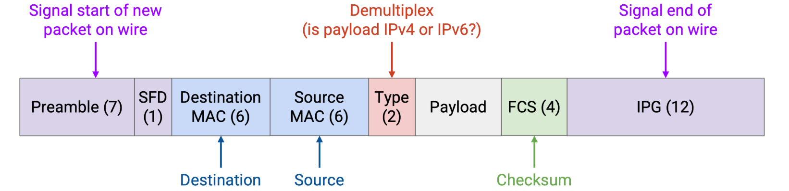

# Ethernet
## Local Networks
The predominant protocol at Layer 2 is Ethernet.

## Connecting Local Hosts
In reality, a single wire might be used to connect multiple machines. In the local network, the hosts and the router can all be on the same wire. We can abstract even further and note that at Layer 2, the router is really just a machine like any other.

A **mesh topology** is impractical. If a new host joins, we’d have to add a wire connecting it to every other host. 
However, a **bus topology**, where we connect all the computers along a single wire, is pretty common and practical in a local network.

The single-wire bus topology introduces the notion of a **shared media**.

## Coordinated Approaches
In a network with a shared medium, there’s a risk that transmissions from different nodes may interfere or collide with each other.
To solve this problem, we need a **multiple access protocol** that ensures that multiple computers can share the link and transmit over it.

### Multiplexing
One possible category of approaches is to allocate a fixed portion of resources to each node on the link. There are two ways we could consider dividing up the resources. 
- In **frequency-division multiplexing**, we allocate a different slice of frequencies to each computer. (Consider AM/FM radio or broadcast TV, which divide up frequencies into channels.) 
- In **time-division multiplexing**, we divide time into fixed slots and allocate a slot to every connected node.

### Taking Turns
In this category, we’re dynamically partitioning by time, so that nodes use only the time they need during their turn, with no wasted time. There are two ways we could consider having nodes take turns.

- In a **polling protocol**, a centralized coordinator decides when each connected node gets to speak. The coordinator goes to each node one by one and asks if the node has something to say. If the node says yes, the coordinator lets the node speak for some time. If the node says no, the coordinator immediately moves on to the next node. 
  Bluetooth is a real-world protocol using this idea.
- The other way is **token passing**. We have a virtual token that can be passed between nodes, and only the node with the token is allowed to speak. If a node has something to say, it holds onto the token while transmitting, then passes it to the next node. If a node doesn’t have anything to say at the moment, it immediately passes the token to the next node. 
  IBM Token Ring and FDDI are real-world examples of protocols that use this idea.

### Random Access
In this approach, we just allow nodes to talk whenever they have something to say, and deal with collisions when they occur. The nodes don’t coordinate between each other, and just send data whenever they have something to send.

When the recipient gets a packet, it replies with an ack. If two nodes send data simultaneously, the collision causes their packets to be corrupted, so no ack is sent. If the sender doesn’t see an ack, it *waits some random amount of time* and re-sends. 

A more “polite” variant of this protocol is called **Carrier Sense Multiple Access (CSMA)**. Nodes listen (sensing a signal on the wire) to the shared medium first to see if anybody is speaking, and only start talking when it is quiet. 
However, propagation delay can introduce issues.

To mitigate this problem, we can use **CSMA/CD** (Carrier Sense Multiple Access with **Collision Detection**). In addition to listening before speaking, we also listen *while* we speak. If you start hearing something while you’re transmitting, you stop immediately.

To deal with repeated collisions, CSMA/CD uses **binary exponential backoff**. Each time we detect a collision on a retransmission attempt, we wait up to twice as long before the next retransmission. 
Note that we still randomly choose the retransimssion time, but each time we detect a collision, we choose the random number from a range with a limit that’s twice as high. For example, if we chose a random time in the range [0, 4] and detected a collision, the next random time we choose is in the range [0, 8].

## LAN Communication: MAC Addresses

At Layer 2, every computer has a **MAC address** (Media Access Control). 
MAC addresses are 48 bits long, and are usually written in hexadecimal with colons separating every 2 digits, e.g. `f8:ff:c2:2b:36:16`. MAC addresses are sometimes called **ether addresses** or **link addresses**.

MAC addresses are usually permanently hard-coded (“burned in”) on a device, 
which is different from IP, where you receive an address when you first join a network, and the address depends on your geographic location.

## LAN Communication Types
There are different possible destinations in a Layer 2 packet. 
- In **unicast**, the packet is intended to a single recipient. 
- In **broadcast**, the packet is intended for all machines on the local network. 
- In **multicast**, the packet is intended for all machines in the local network that belong to a particular group. Machines can choose to join certain groups to receive packets meant for that group.

## Ethernet Packet Structure
A data packet in Ethernet is called a **frame**.

To broadcast a message, we set the destination MAC to the special address `FF:FF:FF:FF:FF:FF` (all ones).

To multicast a message, we set the destination MAC to the address of that group. Recall that the first two bits of the MAC addresses are flags. Normal addresses allocated to machines always set the first bit to 0, and addresses for groups always set the first bit to 1. 

## Layer 2 Networks with Ethernet
We could introduce multiple links and build a network entirely using Layer 2. Packets could be forwarded, and machines could even run routing protocols, all exclusively using Layer 2 MAC addresses.

