# Layers of Internet
## Layer 1: Physical Layer
In the Internet, we’re looking for a way to signal bits (1s and 0s) across space. 
The technology could be voltages on an electrical wire, wireless radio waves, light pulses along optical fiber cables, among others.

## Layer 2: Link Layer
In the Internet, a **link** connects two machines. That link could be using any sort of technology (wired, wireless, optical fiber, etc.). If we use links to connect up a bunch of nearby computers, we get a **local area network (LAN)**.

At Layer 2, we can also group bits into units of data called **packets** (or **frames** at this layer), and define where a packet starts and ends in the physical signal. We can also handle problems like multiple people simultaneously using the same wire to send data.

## Layer 3: Internet Layer
In the Internet, the post office receiving and redirecting mail is called a **switch** or **router**.

If we build additional links between switches, we can connect up **local networks**. 

With enough links and local networks, we can connect everybody in the world, resulting in the **Internet**.

On the Internet, the operators are **Internet service providers**, who own and operate Internet structure.

### Network of Networks
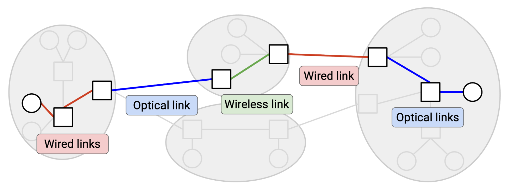
In the Internet, **end hosts** are machines (e.g. servers, laptops, phones) communicating over the Internet. By contrast, a **switch** (also called a **router**) is a machine that isn’t sending or receiving its own data, but exists to help the end hosts communicate with each other. 

### Best-Effort Service Model
service model: a contract between the network and users, describing what the network does and doesn’t support.
The designers of the Internet didn’t support any of those models. Instead, the Internet only supports **best effort** delivery of data.
If you send data over Layer 3, the Internet will try its best to deliver it, but there is no guarantee that the data will be delivered. The Internet also won’t tell you whether or not the delivery succeeded.

### Packets Abstraction
Packets are limited in size. If the application has some large data to send (e.g. a video), we need to somehow split up that data into packets, and send each packet through the network independently.

## Layer 4: Transport

This layer uses Layer 3 as a building block, and implements an additional **protocol** for 
- re-sending lost packets, 
- splitting data into packets, and 
- reordering packets that arrive out-of-order (among other features).

The transport layer protocol allows us to stop thinking in terms of packets, and start thinking in terms of **flows**, streams of packets that are exchanged between two endpoints.

## Layer 7: Application
The Internet’s design allows it to be a general-purpose communication network for any type of application data.

---

Each layer relies on services *from* the layer directly below, and provides services *to* the layer directly above.
Two layers interact directly through the **interface** between them.

---

# Headers

Just like the envelope, when we send a packet, we need to attach additional metadata that tells the network infrastructure what to do with that packet. This additional metadata is called a **header**. The rest of the bits (e.g. the file being sent, the letter inside the envelope) is called the **payload**.

- The network infrastructure should only read the **header** to decide how to deliver the data.

- The application at the end host cares about the **payload**, not the header. That said, the end hosts still need to know about headers, in order to add headers to packets before sending them.

## Headers are Standardized
Everybody on the Internet (every end host, every switch) needs to agree on the format of a header.

## What Should a Header Contain?
- destination address, definitely

other information that’s not required, but is useful to have:
- the source address

- checksum, to ensure that packet is not corrupted while in transit

- other metadata like the length of the packet

## Multiple Headers
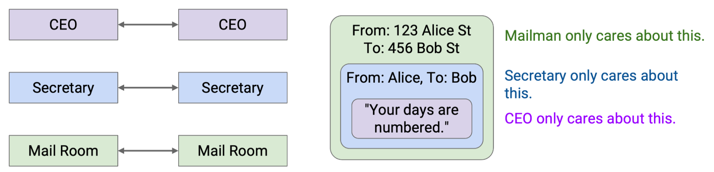
Note that some layers offer multiple choices of protocol (e.g. wireless or wired protocols at Layer 2). In these cases, the two people communicating need to use the same choice of protocol. A wired sender can’t talk to a wireless recipient.

## Addressing and Naming
Different layers in the Internet have different addressing schemes that work best for that particular layer.

- Sometimes a host is referred to by its human-readable name (e.g. www.google.com). 
- Other times, that same host is referred to by a machine-readable **IP address** (e.g. 74.124.56.2), where this number somehow encodes something about the server’s location (and could change if the server moves). 
- Other times, that same host could be referred to by its hardware **MAC address**, which never changes.

## Layers at Hosts and Routers

### Layers 
- The **end hosts** need to implement all the layers.
- The **router** does need Layer 1 for receiving bits on a wire, Layer 2 for sending packets along the wire, and Layer 3 for forwarding packets in the global network.

### Multiple Headers 
First, Host A takes the message and works its way down the stack, adding headers for Layer 7, 4, 3, 2, and 1. 
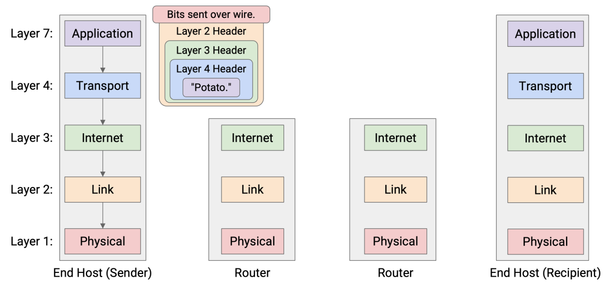

The router reads and unwraps the Layer 1 and Layer 2 headers, revealing the Layer 3 header underneath. The router reads this header to decide where to forward the packet next.
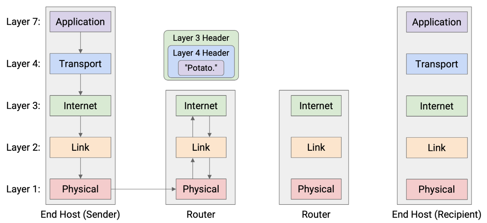

Now, to pass the packet along to the next hop, the router must go down the stack again, wrapping new Layer 2 and Layer 1 headers, and then sending the bits along the wire to the next hop.
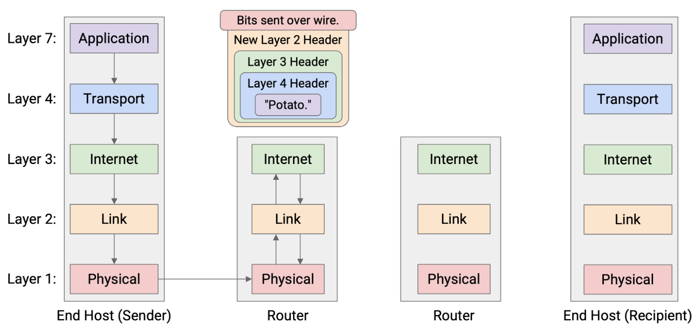

This pattern repeats at every router

Eventually, the packet reaches Host B, who unwraps every layer, one by one: Layer 1, 2, 3, 4, 7. Host B has successfully received the message!
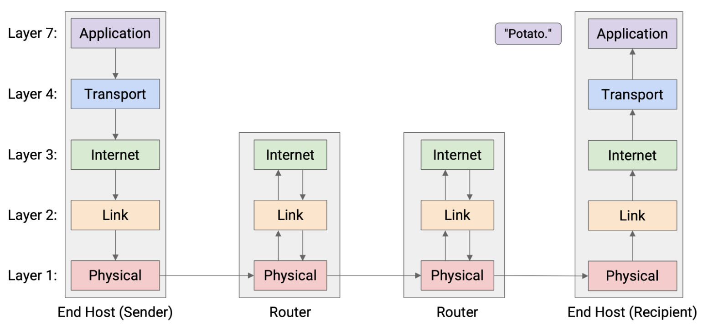

In summary: Each router parses Layers 1 through 3, while the end hosts parse Layers 1 through 7.
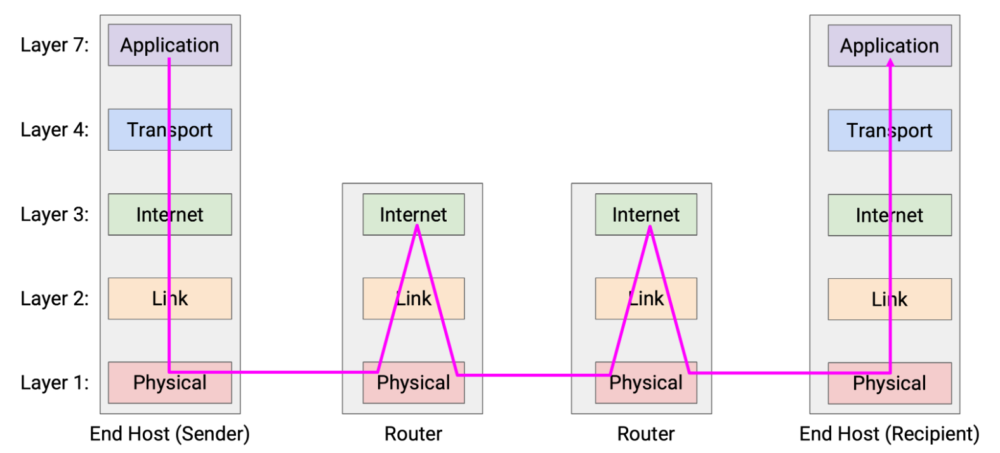

### Consequence
One consequence of this layering scheme is that each hop can use *different protocols at Layer 2 and 1*.
More generally, we said that each layer only needs to communicate with its peers at the same layer. 
- The host’s peer is the other host.
- The router’s peers are its neighboring routers along the path.

# Network Architecture

The term **socket** refers to an OS mechanism for connecting an application to the networking stack in the OS. 
When an application opens a socket, that socket is associated with a logical port number. When the OS receives a packet, it uses the port number to direct that packet to the associated socket.

# Designing Resource Sharing
## Statistical Multiplexing
The Internet needs to support many simultaneous flows at the same time, despite limited capacity.

We often say that the network resources are **statistically multiplexed**, which means that we’ll dynamically allocate resources to users based on their demand, instead of partitioning a fixed share of resources to users.

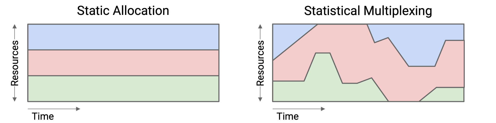

The premise that makes statistical multiplexing work is: In practice, the *peak of aggregate* demand is much less than the *aggregate of peak* demands.

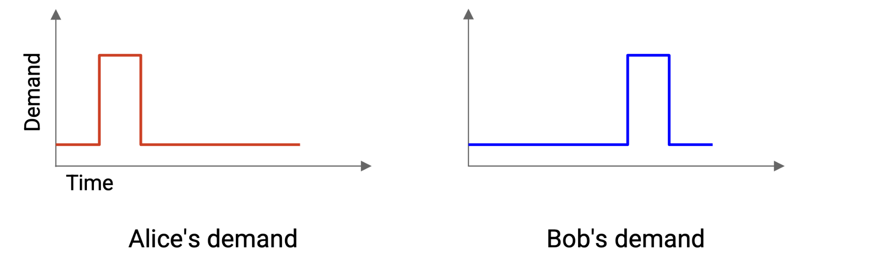
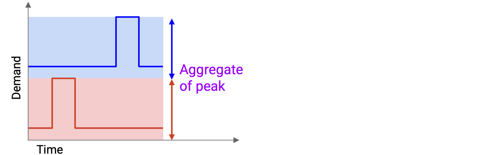
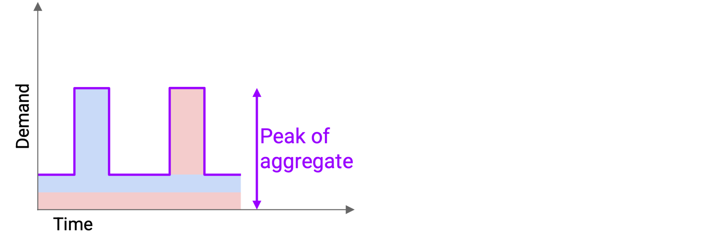

Peaks could still happen at the same time, which would cause packets to be delayed or dropped (recall the link queue). 
Nevertheless, we made the design choice to statistically multiplex and use resources more efficiently, while dealing with the consequences (occasional simultaneous peaks).

## Circuit Switching vs. Packet Switching
How do we actually dynamically allocate resources between users?

### Packet Switching
One approach is **best-effort**. 

Everybody sends their data into the network and hopes for the best. There’s no guarantee that there will be enough bandwidth to meet your demand.
The switch looks at each packet independently and forwards the packet closer to its destination. 
The switches are also independent from each other. As a packet hops across switches, every switch considers the packet independently.

### Circuit Switching
The other approach is based on 

At the start of a flow, the end hosts identify a path (sequence of switches and links) through the network, using some routing algorithm. 
Then, the source sends a special reservation request message to the destination. Along the way, every switch hears about this request as well. If every switch accepts the request, then the reservation is made, and a circuit of switches has been established between the source and destination.
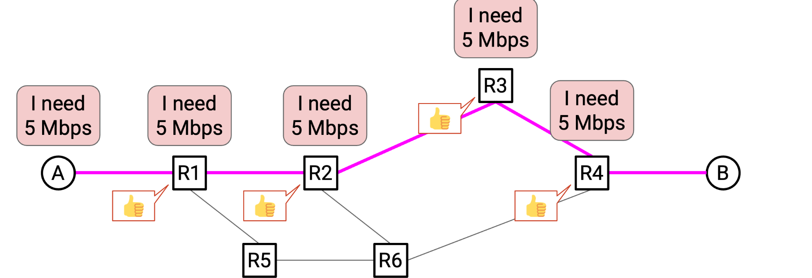

Once the reservation is confirmed by every switch, data can be sent. Eventually, when the flow ends, the source sends a teardown message to the recipient. Along the way, every switch sees this message and releases its capacity.
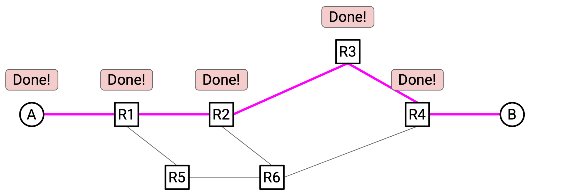

---
Remember, both circuit switching and packet switching are embodying **statistical multiplexing**. 
The main difference is the granularity at which we’re allocating resources: *per-flow* with reservations, or *per-packet* with best-effort. 
Even in circuit switching, we’re dynamically allocating resources based on reservations. We are not preemptively reserving for all flows that might ever exist.

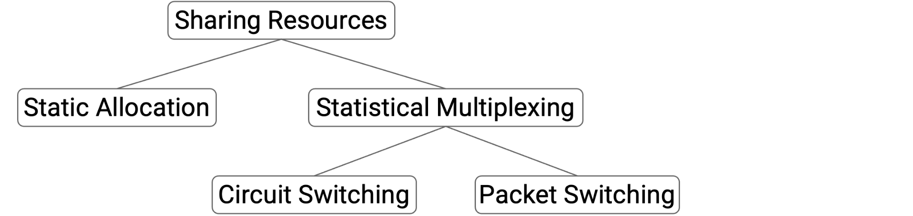

## Trade-offs
Circuit switching gives the application better performance with reserved bandwidth. It also gives the developer more predictable behavior.

However, packet switching gives us more efficient sharing of bandwidth, and avoids startup time. It also gives us easier recovery from failure, and is generally simpler to implement (less for routers to think about).

## In Practice 
In the modern Internet, packet switching is the default approach.

# Link
## Properties of Links
The **bandwidth** of a link tells us how many bits we can send on the link per unit time. 
Intuitively, this is the *speed* of the link. 
We usually measure bandwidth in **bits per second** (e.g. 5 Gbps = 5 billion bits per second).

The **propagation delay** of a link tells us how long it takes for a bit to travel along the link. 
Propagation delay is measured in time (e.g. nanoseconds, milliseconds).
-- In the context of a link, the **latency** is its propagation delay, though this word can also be used in other contexts

If we multiply the bandwidth and the propagation delay, we get the **bandwidth-delay product (BDP)**. 
Intuitively, this is the *capacity* of the link, or the number of bits that exist on the link at any given instant. 

pipe analogy:
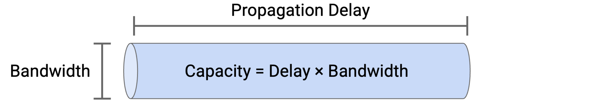

## Packet Delay
The **transmission delay** tells us how long it takes to put the bits on the wire. 
In general, this is the packet size divided by the link bandwidth.

The **packet delay** is the time it takes for an entire packet to be sent, starting from the time the first bit is put on the wire, to the time the last bit is received at the other end. 
This delay is the sum of the **transmission delay** and the **propagation delay**.

## Overloaded Links
### Transient Overload
In the long term, we have enough capacity to send all the outgoing packets, but at this very instant in time, we have two packets arriving simultaneously, and we can only send out one.

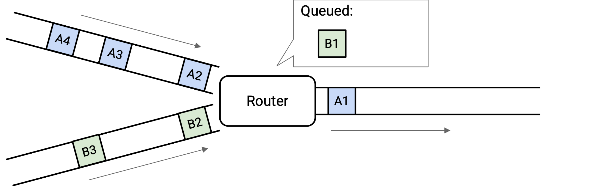

 
To cope with transient overload, the switch maintains a *queue* of packets. If two packets arrive simultaneously, the switch queues one of them and sends out the other one.
At any given time, the switch could choose to send a packet from one of the incoming links, or send a packet from the queue. This choice is determined by a **packet scheduling** algorithm.

### Persistent Overload
There just isn’t enough capacity on the outgoing link to support the level of incoming traffic.

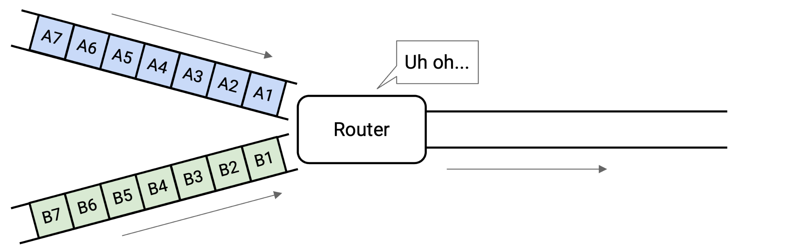

We could fill the queue up, but that still isn’t enough to support the incoming load. One way or another, the switch will drop packets.
One possible solution to overload is to have the router tell the senders to slow down.

