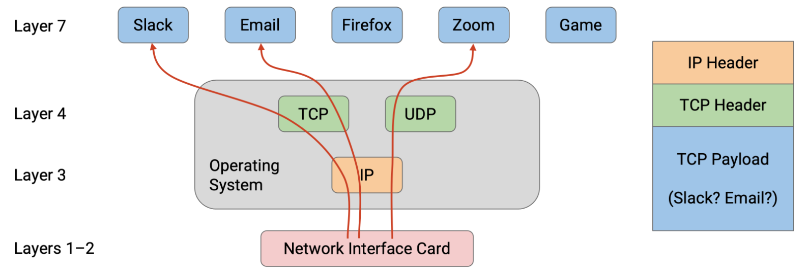
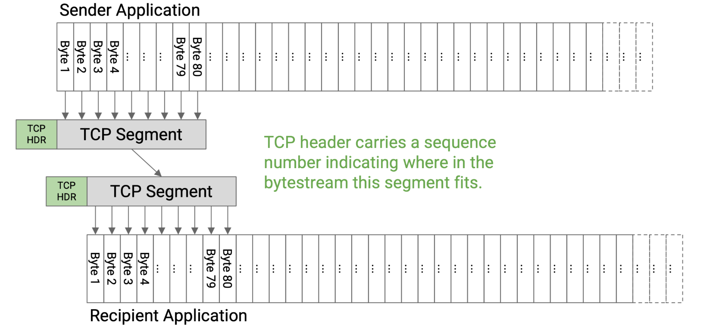
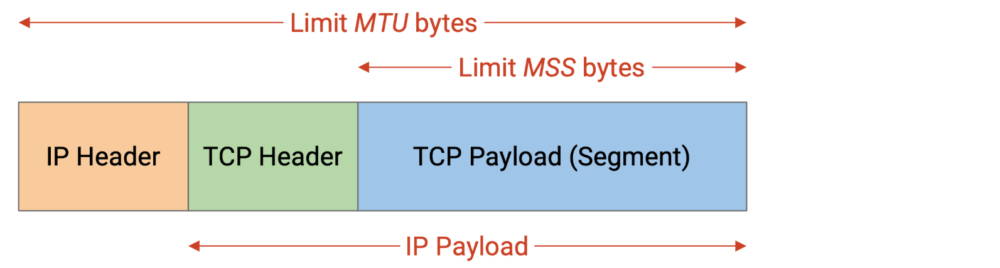
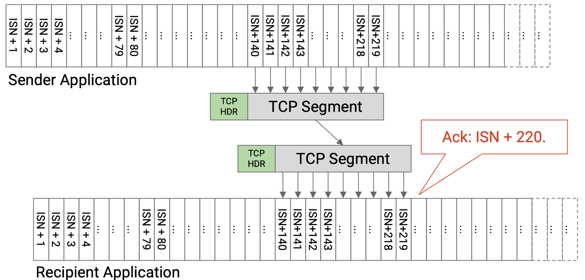

# Transport Layer Principles
## Transport Layer Goals
- reliability
- demultiplexing
- flow control and congestion control

## Reliability Absraction
Many applications require reliability.
However, Layer 3 only provided unreliable, best-effort packet delivery. Packets can be lost (dropped), corrupted, and reordered. Packets can be delayed (e.g. a packet could stuck in a queue waiting to cross a link). In rare cases, packets can even be duplicated.

For practical reasons, reliability is implemented at the end hosts, not at intermediate routers. 
Also, reliability is implemented in the *operating system* for convenience, so that applications don’t need to all re-implement their own reliability.

We will formalize reliability by defining **at-least-once delivery**. In this model, the destination must receive every packet, without corruption, at least once, but may receive multiple duplicate copies of a packet. 

## Demultiplexing with Ports
Suppose that my personal computer has two applications that are both talking to the same server. When packets arrive at my personal computer, they have the same source IP address (server), and the same destination IP address (my computer). How can I tell which packets are meant for which application?

In order to distinguish, or **demultiplex**, which packets are meant for which application, the transport layer header includes an additional **port number**, which can be used to identify a specific application on an end host.

Because *the transport layer is implemented in the operating system*, these ports are the attachment point where the application connects to the operating system’s network stack.  
The application knows its own port number, and the operating system knows the port numbers for all the applications, and the matching number is how data is unambiguously transferred between the application and operating system.

The modern Internet commonly uses the client-server design, where clients access services, and servers provide those services. 
- Servers usually listen for requests on well-known ports (port numbers 0-1023). Clients know these ports and can access them to request services. 
  For example, application-level protocols with well-known port numbers include HTTP (port 80) and SSH (port 22).
- By contrast, clients can select their own random port numbers (usually port numbers 1024-65535). 
  Client port numbers are **ephemeral**, because the port number can be abandoned after the connection is over, and does not need to be permanent.

## Bytestream Abstraction
Implementing reliability at the transport layer means that the application developer no longer needs to think in terms of individual limited-size packets being sent across the network. Instead, the developer can think in terms of a **reliable in-order bytestream**.
The sender has a stream of bytes with no length limit, and provides this stream to the transport layer. Then, the recipient receives the exact same stream of bytes, in the same order, with no bytes lost.

## UDP and Datagrams
Applications that don’t need reliability can use UDP (User Datagram Protocol)at the transport layer. 
- UDP does not provide reliability guarantees. If the application needs a packet to arrive, the application must handle re-sending packets on its own (the transport layer will not re-send packets). 
- Messages in UDP are limited to a single packet -- **UDP datagram**. If the application wants to send larger messages, the application is responsible for breaking up and reassembling those messages. 
- Note that UDP still implements the notion of ports for demultiplexing, though.

---

| TCP  |  UDP |
|---|---|
| demultiplexing  |  demultiplexing |
|bytestream abstraction| datagram abstraction|
|reliability|-|

# TCP Design
## Reliably Delivering a Single Packet
- The time it takes for a packet to travel from sender to receiver is the **one-way delay**. 
- The time it takes for a packet to travel from sender to receiver, plus the time for a reply packet to travel from receiver to sender, is the **round-trip time (RTT)**.

>How does the sender know if the packet was successfully received?

The receiver can send an acknowledgment (ack) message, confirming that the packet was received.

>What happens if the packet gets dropped? 

The sender can maintain a **timer**. When the timer expires, we can re-send the packet.
When the sender receives an ack, the sender can cancel the timer.

A good timer length would be the round-trip time. 

>What happens if the ack is dropped?

The destination received two copies of the packet. 

>What if the bits are corrupted?

We can add a **checksum** in the transport layer header (different from the IP layer checksum). 
When the receiver sees a corrupt packet, it can do two things: 
- Either the receiver can explicitly re-send a negative acknowledgement (**nack**), telling the sender to re-send the packet.
- Or, the receiver can drop the corrupt packet and do nothing. Then, the sender will time out and re-send the packet.

TCP uses the latter.

>What if the packets are delayed?

If the delay is very long, the sender might time out before the ack arrives. The sender will re-send the packet (so the recipient might get two duplicates), and the sender might get two acks.

>What if the sender sends one packet, but it’s duplicated in the network, and the recipient receives two copies?

The recipient would send two acks, but both the sender and the recipient can safely handle duplicates.

---
In summary, the single-packet reliability protocol is:

If you are the sender: Send the packet, and set a timer. If no ack arrives before the timer goes off, re-send the packet and reset the timer. Stop and cancel the timer when the ack arrives.

If you are the recipient: If you receive the uncorrupted packet, send an ack. 

This protocol guarantees at-least-once delivery.

## Reliably Delivering Multiple Packets

We could follow the same transmission rules (re-send when timer expires) for every single packet. 
To distinguish packets, we can attach a unique **sequence number** to every packet. Each ack will be related to a specific packet. Sequence numbers can also help us reorder packets if they arrive out of order.

>When does the sender send each packet? 

The simplest approach is the **stop and wait** protocol, where the sender waits for packet i to be acknowledged before sending packet i+1. 

How can we make this faster?
We can send packets in parallel. 

When a packet is sent, but its corresponding ack has not been received, we call that packet **in flight**.

## Window-Based Algorithms
We set a limit W and say that only W packets can be in flight at any given time. This is the key idea behind **window-based protocols**, where W is the size of the window.

The sender can start by sending W packets. When an ack arrives, we send the next packet in line.

## Window Size
How should W be selected?

- We want to fully use our available network capacity (“fill the pipe”). 
- However, we don’t want to overload links, since other people may be using that link (congestion control). 
- We also don’t want to overload the receiver, who needs to receive and process all the packets from the sender (flow control).

### Fill the Pipe

# TCP Implement
## TCP Segments
The application is relying on a bytestream abstraction, and is sending us a continuous stream of bytes.
In order to *form packets out of bytes* in the bytestream, we’ll introduce a unit of data called a **TCP segment**. 

The TCP implementation at the sender will collect bytes from the bytestream, one by one, and place those bytes into a TCP segment. When the TCP segment is full, we send that TCP segment, and then start a new TCP segment.

Sometimes, the sender wants to send less data than the maximum segment size. In that case, we wouldn’t want the TCP segment to be waiting forever for more bytes that never come. To fix this, we’ll start a **timer** every time we start filling a new empty segment. If the timer expires, we’ll send the TCP segment, even if it is not full yet.

Before sending the data in a TCP segment, the sender’s TCP implementation will add a **TCP header** with relevant metadata (e.g. sequence number, port numbers). Then, the segment and header are passed down to the IP layer, which will attach an IP header and send the packet through the network.
The TCP segment, with a TCP header and IP header on top, is sometimes called a **TCP/IP packet**. Equivalently, this is an **IP packet** whose payload consists of a TCP header and data.

How should the **maximum segment size (MSS)** be set?
MSS (TCP segment limit) = MTU (IP packet limit) - IP header size - TCP header size

## Sequence Numbers
In practice, instead of numbering individual segments, we assign a number to every byte in the bytestream. 
Each segment’s header will contain a **sequence number** corresponding to the number of the first byte in that segment.

Each bytestream starts with an **initial sequence number (ISN)**. The sender chooses an ISN and labels the first byte with number ISN+1, and so on.

The acknowledgement number says, I have received all bytes up to, but not including, this number.

Historically, the ISN was chosen to be random because the designers were concerned about ambiguous sequence numbers if all bytestreams started numbering at 0. 
In practice, the ISN is chosen to be random for security reasons.

## TCP State
In TCP, both the sender and recipient need to maintain state.
- The sender has to remember which bytes have been sent but not acknowledged yet. The sender also has to keep track of various timers.

- The recipient has to remember the out-of-order bytes that can’t be delivered to the application yet.
  
Because TCP requires storing state, each bytestream is called a **connection** or **session**, and TCP is a **connection-oriented protocol**.
TCP requires both parties to establish a connection and initialize state before data can be sent. TCP also needs a mechanism to tear down connections to free up the memory allocated for state on both end hosts.

## Full Duplex
To support sending messages in both directions, TCP connections are **full duplex**. Instead of designating one sender and one recipient, both end hosts in the connection can send and receive data simultaneously, in the same connection.

To support sending data in both directions, each TCP connection has two bytestreams: A to B, and B to A.

Each packet can contain both data and acknowledgement information. 
The sequence number would correspond to the sender’s bytestream (the bytes I am sending).
The acknowledgement number would correspond to the recipient’s bytestream (the bytes I received from you).

## TCP Handshake
To establish a TCP connection, the two hosts perform a three-way handshake to agree on the ISNs in each direction.

## Ending Connections

## Piggybacking
When the recipient gets a packet, if it has no data to send, the recipient has two choices. 
- immediately send the ack, with no data to send
- wait until it has some data to send, and then send the ack with the new data -- **piggybacking**

## Sliding Window

## Detecting Loss and Re-Sending Data