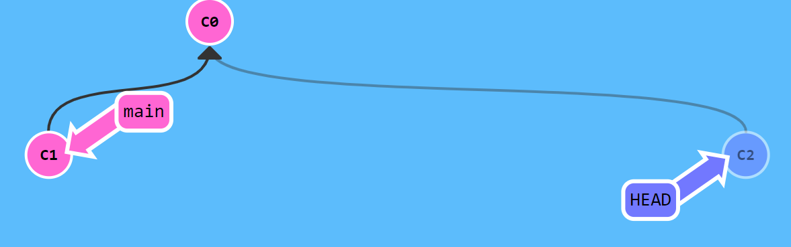
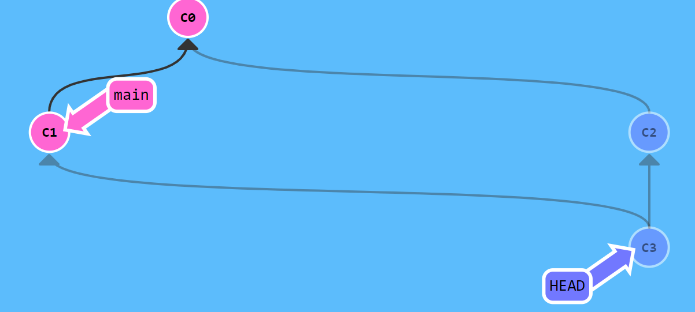

# <center> Version Control
# Git's data model
A file is called a "blob", and it's just a bunch of bytes.
A directory is called a "tree", and it maps names to blobs or trees.
A snapshot is the top-level tree that is being tracked.
A commit is a combination of log messages, other metadata (commit date, author, etc.), a reference to a tree, and references to parent commits. 

```
// a file is a bunch of bytes
type blob = array<byte>

// a directory contains named files and directories
type tree = map<string, tree | blob>

// a commit has parents, metadata, and the top-level tree
type commit = struct {
    parents: array<commit>
    author: string
    message: string
    snapshot: tree
}
```

## Modeling history: relating snapshots
```
o <-- o <-- o <-- o <---- o
            ^            /
             \          v
              --- o <-- o

```

## Objects and content-addressing
```py
type object = blob | tree | commit
```
In Git data store, all objects are **content-addressed** by their SHA-1 hash.
```py
objects = map<string, object>

def store(object):
    id = sha1(object)
    objects[id] = object

def load(id):
    return objects[id]
```
e.g. the tree above:
```sh
git cat-file -p 698281bc680d1995c5f4caaf3359721a5a58d48d

    100644 blob 4448adbf7ecd394f42ae135bbeed9676e894af85    baz.txt
    040000 tree c68d233a33c5c06e0340e4c224f0afca87c8ce87    foo

git cat-file -p 4448adbf7ecd394f42ae135bbeed9676e894af85

    git is wonderful
```

## References
References are pointers to commits.
```py
references = map<string, string>

def update_reference(name, id):
    references[name] = id

def read_reference(name):
    return references[name]

def load_reference(name_or_id):
    if name_or_id in references:
        return load(references[name_or_id])
    else:
        return load(name_or_id)
```


# Branch
<https://learngitbranching.js.org/?locale=zh_CN>


- `git branch`: shows branches
- `git branch <name>`: creates a branch
- `git checkout -b <name>`: creates a branch and switches to it
    - same as `git branch <name>; git checkout <name>`
- `git merge <revision>`: merges into current branch
Fast forwarding


merge 2 'branches'


- `git mergetool`: use a fancy tool to help resolve merge conflicts
- `git rebase`: rebase set of patches onto a new base
  
# Remote

- `git remote`: list remotes
- `git remote add <name> <url>`: add a remote
- `git push <remote> <local branch>:<remote branch>`: send objects to remote, and update remote reference
- `git branch --set-upstream-to=<remote>/<remote branch>`: set up correspondence between local and remote branch
- `git fetch`: retrieve objects/references from a remote
- `git pull`: same as `git fetch; git merge`
- `git clone`: download repository from remote